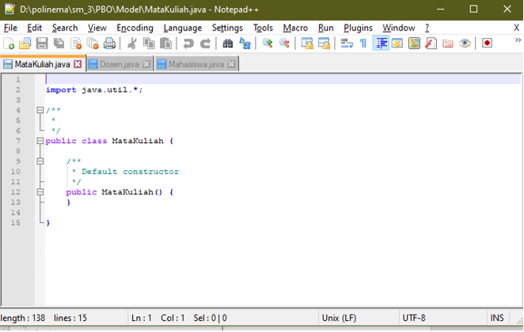
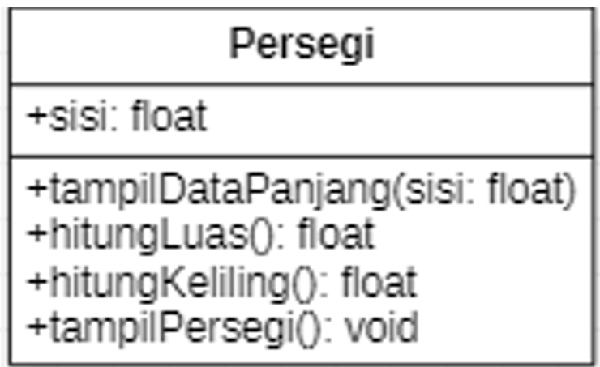

# Laporan Pengumpulan Tugas Teori Minggu Ke 2

1.	Jurusan Teknologi Informasi akan membangun system informasi pemberian nilai secara online kepada setiap mahasiswa yang menempuh perkuliahan. Setiap nilai mata kuliah yang akan dimasukkan dalam system di inputkan secara langsung oleh dosen yang bersangkutan. Dari system ini diharapkan mahasiswa akan lebih mudah untuk melakukan evaluasi terhadap setiap matakuliah yang sudah pernah diikuti.
 
    a.	Identifikasi, ada berapa class yang bisa dibuat dari sistem diatas ?
     
    -  Ada 3 yaitu class Mahasiswa,Dosen Dan Mata Kuliah.
 
 
    b.	Implementasikan class dalam bahasa pemrograman java dan class diagram!
     
    a. dalam bentuk class diagram : 
    
     
    b. java kode
     
    -class Mahasiswa
    
     
    -class Dosen
    
     
    -class MataKuliah
    
     

2. Tambahkan secara lengkap attribute pada setiap class yang sudah anda identifikasi pada latihan sebelumnya (Latihan 1)?
 
    a. class diagram
    
    b. java kode
     
    -class Mahasiswa
    
     
    -class Dosen
    
     
    -class MataKuliah
    
     

3. Buatlah implementasi dengan menggunakan class diagram dari soal berikut :
› Class Persegi dengan atribut sisi dengan tipe data integer.
› Terdapat tiga method :
-Method data persegi untuk menampilkan data panjang sisi dari persegi tersebut.
-Method luas persegi untuk menghitung luas dari persegi tersebut dengan rumus : sisi x sisi.
-Method keliling persegi untuk menghitung keliling dengan rumus : 4 x sisi.
› Tampilkan data persegi, nilai luas persegi dan keliling persegi pada class
TampilPersegi.
Jawaban :
Class diagram : 
 
    a. class diagram
    
    b. java kode
     
    