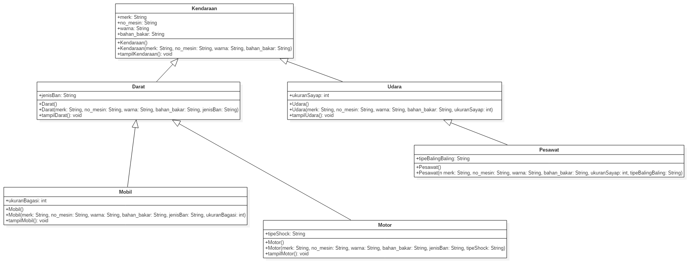
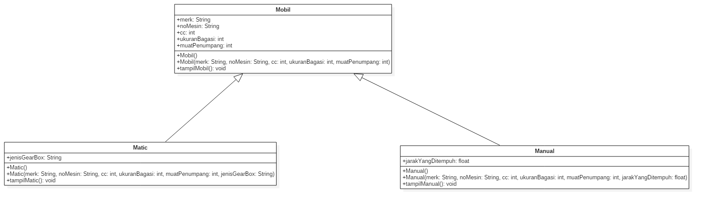

# Laporan Tugas Teori PBO Minggu Ke 7

## Hybrid Inheritance

 hybrid terdapat class yang terdaftar sebagai subclass namun class tersebut juga termasuk super seperti pada gambar class darat adalah subclass dari kendaraan namun darat adalah super class dari mobil dan motor

## Hierarchical Inheritance

Hierarchical inheritance merupakan contoh pewarisan yang terjadi ketika sebuah kelas memiliki
lebih dari satu kelas turunan (subclass) atau dengan kata lain, lebih dari satu kelas turunan
memiliki kelas induk yang sama. seperti pada digambar class manual dan matic memiliki satu induk class yang sama
