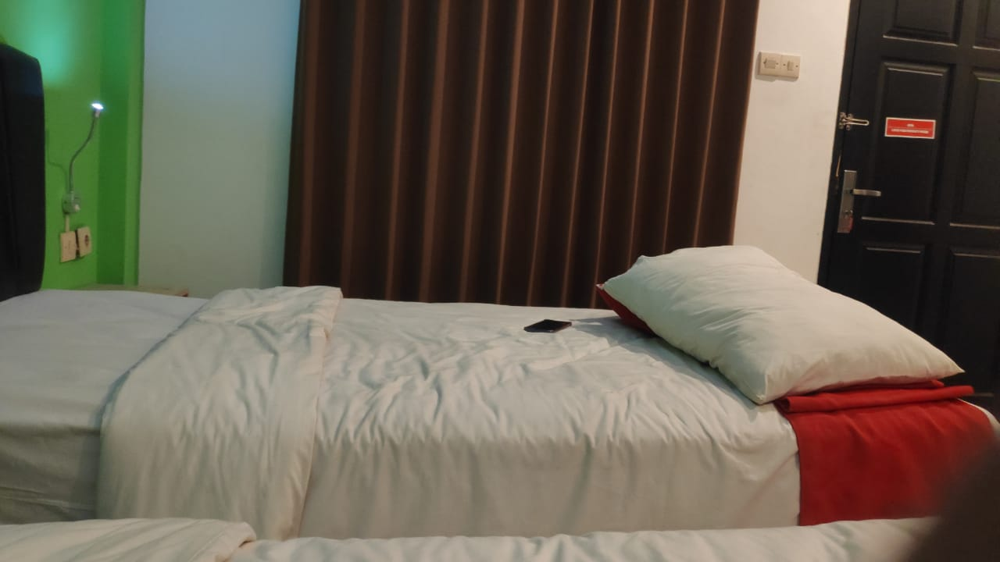
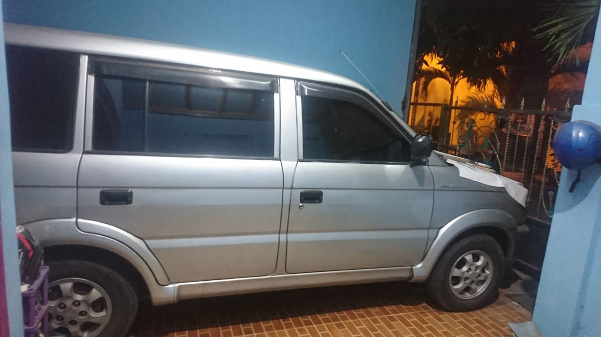
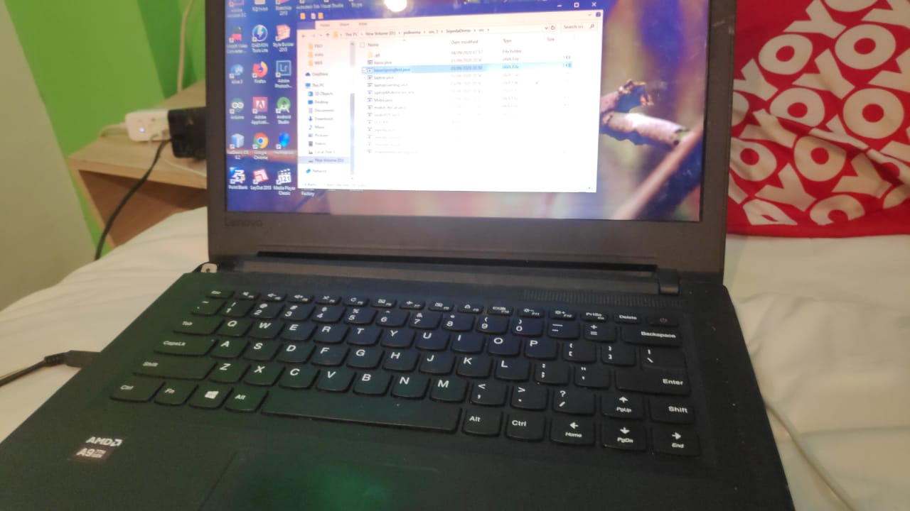

# Laporan Tugas Minggu 1 Mata Kuliah PBO

<marquee> Pemograman Berbasis Objek </marquee>

# Pengamatan Saya Mencari 4 Buah Objek Yang Memiliki Konsep Pewarisan (inheritance) Antara Lain :

1. Kasur

Saya Memilih Kasur Karena Memiliki Pewarisan contoh Kasur Spring bed yang Berbeda dengan kasur lainya, kasur spring bed memiliki pegas berbeda dengan kasur lainya namun tetap mewarisi kasur.
 
 
State 
- Merek
- ukuran
- warna 
 
 
Behavior
 
 
- Tekanan Pegas
- Gerakan Kasur (Naik/Turun)
2. Mobil

Saya Memilih Mobil Karena Memiliki Pewarisan contoh Mobil SUV yang dimana roda penggeraknya ada 4 buah bisa disebut 4WD berbeda dengan mobil lainya namun tetap mewarisi mobil.
 
 
State 
 
- Merek
- No Mesin
- Tipe Mobil
- Tipe Bahan Bakar
- Warna
 
 
Behavior
 
 
- Tambah Kecepatan
- Kurangi Kecepatan (Rem)
- Nyalakan Lampu 
- Matikan Lampu
- Nyalakan Radio
- Nyalakan AC
- Nyalakan Mesin
- Mematikan Mesin
- Ganti Gear
- Gerakan Posisi Duduk 

3. Laptop

Saya Memilih Laptop Karena Memiliki Pewarisan contoh Laptop Gaming yang dimana keyboardnya full colour led berbeda dengan laptop lainya namun tetap mewarisi laptop.
 
 
State 
- Merek
- ukuran
- warna 
- ram
- prosesor
 
 
Behavior
 
 
- matikan daya
- nyalakan daya
- gerakan cursor
- ketik keyboard
- tambah volume
- kurangi volume
4. Smartphone 

Saya Memilih hp Karena Memiliki Pewarisan contoh Laptop Gaming yang dimana keyboardnya full colour led berbeda dengan laptop lainya namun tetap mewarisi laptop.
 
 
State 
- Merek
- ukuran
- warna 
- ram
- prosesor
 
 
Behavior
 
 
- matikan daya
- nyalakan daya
- tambah volume
- kurangi volume

# Pembuatan Program Dengan NetBeans Setelah Melakukan Pengamatan 

1. Mobil
2. Laptop
3. Smartphone
4. Kasur