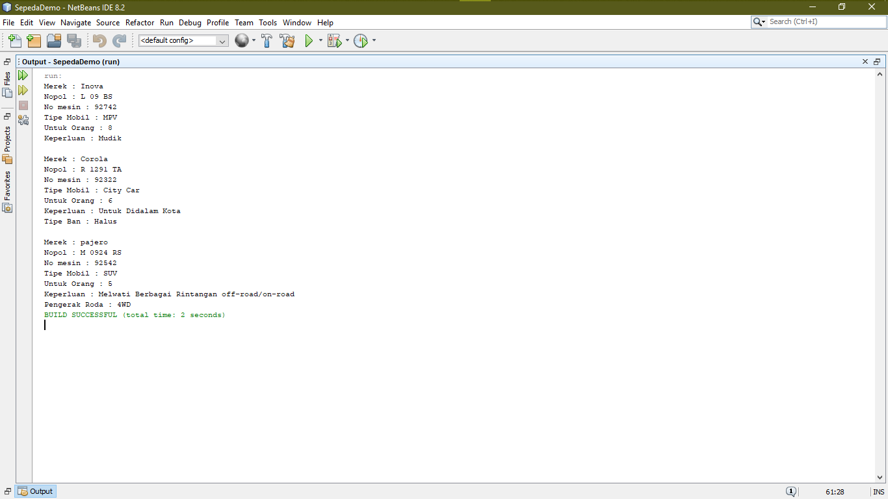
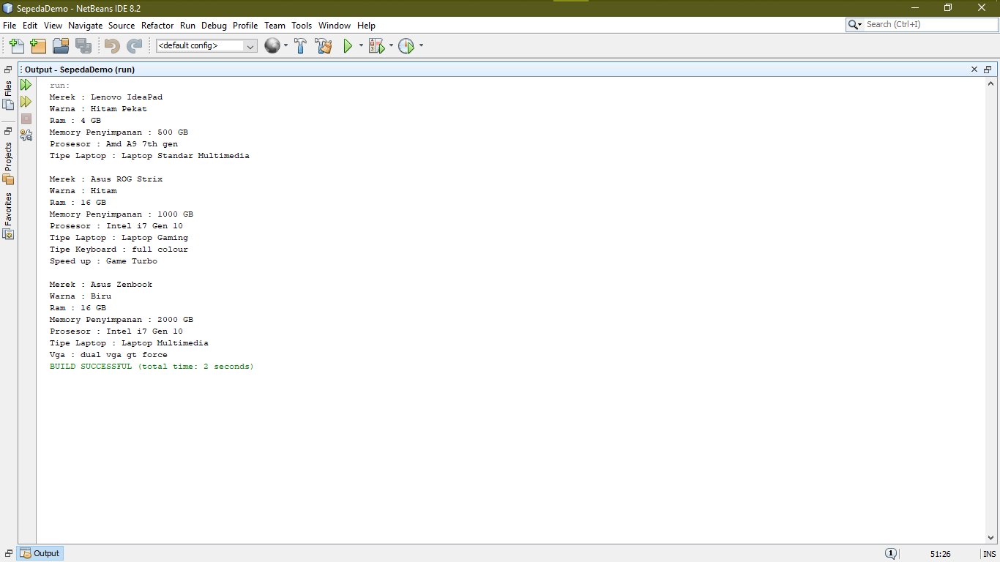
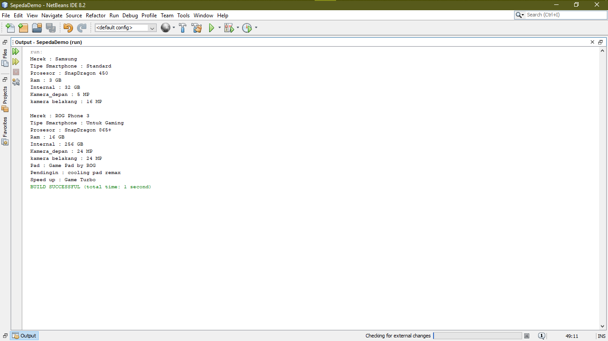
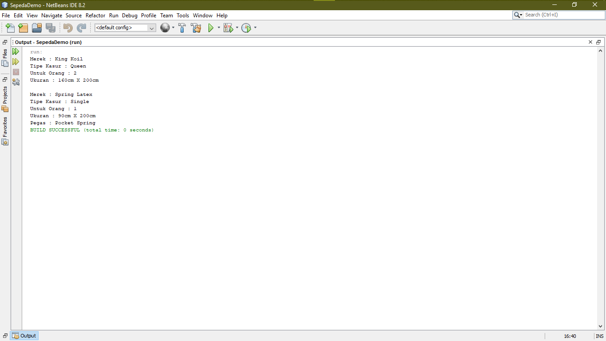

# Laporan Tugas Minggu 1 Mata Kuliah PBO

## Pengamatan Saya Mencari 4 Buah Objek Yang Memiliki Konsep Pewarisan (inheritance) Antara Lain :

1. Kasur

Saya Memilih Kasur Karena Memiliki Pewarisan contoh Kasur Spring bed yang Berbeda dengan kasur lainya, kasur spring bed memiliki pegas berbeda dengan kasur lainya namun tetap mewarisi kasur.
 
 
State 
 
- Merek
 
- ukuran
 
- warna 
 
 
Behavior
 
 
- Tekanan Pegas
 
- Gerakan Kasur (Naik/Turun)
 
 
2. Mobil

Saya Memilih Mobil Karena Memiliki Pewarisan contoh Mobil SUV yang dimana roda penggeraknya ada 4 buah bisa disebut 4WD berbeda dengan mobil lainya namun tetap mewarisi mobil.
 
 
State 
 
- Merek
 
- No Mesin
 
- Tipe Mobil
 
- Tipe Bahan Bakar
 
- Warna
 
 
Behavior
 
 
- Tambah Kecepatan
 
- Kurangi Kecepatan (Rem)
 
- Nyalakan Lampu 
 
- Matikan Lampu
 
- Nyalakan Radio
 
- Nyalakan AC
 
- Nyalakan Mesin
 
- Mematikan Mesin
 
- Ganti Gear
 
- Gerakan Posisi Duduk 
 
 
3. Laptop

Saya Memilih Laptop Karena Memiliki Pewarisan contoh Laptop Gaming yang dimana keyboardnya full colour led berbeda dengan laptop lainya namun tetap mewarisi laptop.
 
 
State 
 
- Merek
 
- ukuran
 
- warna 
 
- ram
 
- prosesor
 
 
Behavior
 
 
- matikan daya
 
- nyalakan daya
 
- gerakan cursor
 
- ketik keyboard
 
- tambah volume
 
- kurangi volume
 
 
4. Smartphone 

Saya Memilih hp Karena Memiliki Pewarisan contoh Laptop Gaming yang dimana keyboardnya full colour led berbeda dengan laptop lainya namun tetap mewarisi laptop.
 
 
State 
 
- Merek
 
- ukuran
 
- warna 
 
- ram
 
- prosesor
 
 
Behavior
 
 
- matikan daya
 
- nyalakan daya
 
- tambah volume
 
- kurangi volume
 

# Pembuatan Program Dengan NetBeans Setelah Melakukan Pengamatan 

1. Mobil

Program ini menunjukan list mobil dengan state merek,nopol,no mesin,untuk orang,keperluan. Untuk class berbeda maka saya tambahkan mobil SUV dan mobil city car, perbedaan mobil SUV dengan mobil lainya adalah pengerak roda maka dalam class mobilSUV saya beri method pengerak roda sedangkan untuk mobil city car saya berikan method tipe ban karena tipe ban city car halus berbeda dengan lainya namun tetap saja mewarisi mobil.
 
2. Laptop

Program ini menunjukan list jenis jenis laptop dengan state mere,warna,ram,memory penyimpanan,prosesor,tipe laptop. untuk class berbeda maka saya tambahkan laptop gaming dan laptop multimedia, perbedaan laptop gaming adalah tambahan fitur warna cahaya pada keyboard agar memudahkan playernya dan juga speed up software yang bisa ngeboost game game berat maka saya tambahkan method tipe keyboard dan speedup, sedangkan untuk laptop multimedia ialah vga dual agar pemrosesan rendering dengan sangat cepat maka saya menambahkan method vga namun tetap saja mewarisi laptop.
 
3. Smartphone

program ini menunjukan 2 tipe smartphone yaitu gaming dan pengunaan standar smartphone memiliki state merek,tipe smartphone,prosesor,ram,internal,kamera_depan,kamera_belakang saya tambahkan class baru untuk class smartphone gaming yang membedakan dengan smartphone biasa adalah support pendingin,pad dan booster untuk bermain game namun tetap saja mewarisi smartphone.
 
4. Kasur

program ini menunjukan 2 tipe kasur yaitu kasur biasa dan spirng bed saya tambahkan class spring bed karena berbeda dengan kasur lainya spring bed dilengkapi pegas maka saya beri method pegas namun tetap saja mewarisi kasur