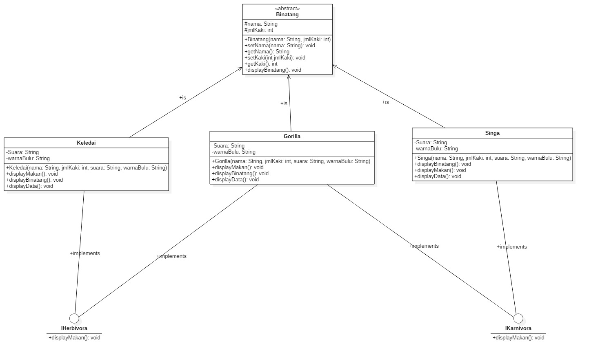

# Laporan Praktikum PBO Pertemuan 11

# Pertanyaan Percobaan 1

1. Pada langkah ke 9, pada baris program ke 3 terdapat warning pada script tersebut.
Jelaskan penyebab terjadinya hal tersebut ?  
jawab :  
karena icumlaude berada pada satu package tidak perlu menggunakan import sudah bisa memakai. 
2. Pada langkah ke 9, pada baris program ke 3. Apa yang terjadi jika script tersebut
dihilangkan? Jelaskan menurut pemahaman anda.  
jawab :  
tidak terjadi error apapun karena tidak perlu lagi untuk mengimport icumlaude yang berada pada satu package 
3. Mengapa pada langkah nomor 9 terjadi error? Jelaskan! 
jawab :  
karena pada class mahasiswa tidak ada method icumlaude jika ingin memberikan nilai pada berisertifikat maka class mahasiswa harus diberikan method lulus dan meraih ipk tinggi agar tidak terjadi error. 
4. Dapatkah method kuliahDiKampus() dipanggil dari objek sarjanaCumlaude di class
Program? Mengapa demikian?  
jawab :  
bisa karena class sarjana me extends class mahasiswa yang memiliki method kuliahDiKampus(). 
5. Dapatkah method kuliahDiKampus() dipanggil dari parameter mahasiswa di method
beriSertifikatCumlaude() pada class Rektor? Mengapa demikian? 
jawab :  
tidak bisa karena method kuliahDiKampus tidak masuk ke dalam interface icumlaude sehingga tidak terdeteksi untuk methodnya. 
6. Modifikasilah method beriSertifikatCumlaude() pada class Rektor agar hasil eksekusi
class Program menjadi seperti berikut ini:
 
jawab :  
menambahkan method kuliahDiKampus() di class sarjana dan class pasca sarjana  

 

# Percobaan 2: Multiple Interfaces Implementation

## memperbaiki langkah 5 

dengan menambahkan semua method dari IBrepestasi maka sarjana bisa dilakukan untuk method berisertifikatmawapres.

# Pertanyaan Percobaan 2

1. Pada script code interface IBerprestasi, modifikasi script tersebut sesuai dengan gambar
dibawah ini :
 
  
jawab :  

 tidak bisa karena interface bersifat public dan akan digunakan di beda class maupun beda package, interface sebagai display saja tidak ada apa apa selain abstract method jika ingin memberikan nilai di class lainya. 

2. Jelaskan menurut anda, mengapa hasil dari script code tersebut error ?  
jawab :  
class intefaces tidak bisa di instasiasi objek karena interface iberprestasi bukan merupakan objek namun file interfaces.
 

3. Apabila Sarjana Berprestasi harus menjuarai kompetisi NASIONAL dan
menerbitkan artikel di jurnal NASIONAL, maka modifikasilah class-class yang terkait
pada aplikasi Anda agar di class Program objek pakRektor dapat memberikan sertifikat
mawapres pada objek sarjanaCumlaude  
menambahkan method  
jawab :  
 
maka hasilnya seperti berikut :  

# Tugas

# Source Code

## Class Binatang : 

 

Class ini menggunakan absctract yang akan mewariskan nama dan jml kaki ke class lainya yang memiliki setter dan getter untuk menambakan dan mengambil nama dan jml kaki.

## Interface IKarnivora : 

 

interface ini untuk menampilkan makanan hewan karnivora

## Interface IHerbivora : 

 

interface ini untuk menampilkan makanan hewan herbivora

## Class Keledai : 

 

didalam class kedelai terdapat konstruktor dimana ada atribut nama dan jmlkaki yang berasala dari class abstract binatang dan atribut 2 tambahan suara dan warna bulu class ini di implementasikan ke herbivora karena kedelai adalah herbivora lalu memberikan nilai di display makanan yang sesuai dan memberikan nilai display binatang untuk mengetahui jenis binatangnya dan untuk mendapatkan nama,jumlahkaki,suara maupun warna bulu di deklrasikan di method displaydata this untuk mengambil nilai atribut class keledai dan get untuk mengambil nilai di class binatang.

## Class Singa : 

 

didalam class Singa terdapat konstruktor dimana ada atribut nama dan jmlkaki yang berasala dari class abstract binatang dan atribut 2 tambahan suara dan warna bulu class ini di implementasikan ke karnivora karena singa adalah karnivora lalu memberikan nilai di display makanan yang sesuai dan memberikan nilai display binatang untuk mengetahui jenis binatangnya dan untuk mendapatkan nama,jumlahkaki,suara maupun warna bulu di deklrasikan di method displaydata this untuk mengambil nilai atribut class singa dan get untuk mengambil nilai di class binatang.

## Class Gorilla : 

 

didalam class Gorilla terdapat konstruktor dimana ada atribut nama dan jmlkaki yang berasala dari class abstract binatang dan atribut 2 tambahan suara dan warna bulu class ini di implementasikan ke karnivora dan herbivora karena gorila adalah karnivora dan herbivora lalu memberikan nilai di display makanan yang sesuai dan memberikan nilai display binatang untuk mengetahui jenis binatangnya dan untuk mendapatkan nama,jumlahkaki,suara maupun warna bulu di deklrasikan di method displaydata this untuk mengambil nilai atribut class gorilla dan get untuk mengambil nilai di class binatang.

## Class Main : 

 

pada main kita memberikan nilai pada class gorila,singa dan kedelai sesuai dengan tugas dan ditampilkan sesuai dengan inisialisasi objeknya.

# Output : 

# Class Diagram :

