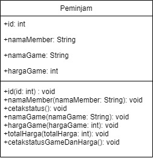
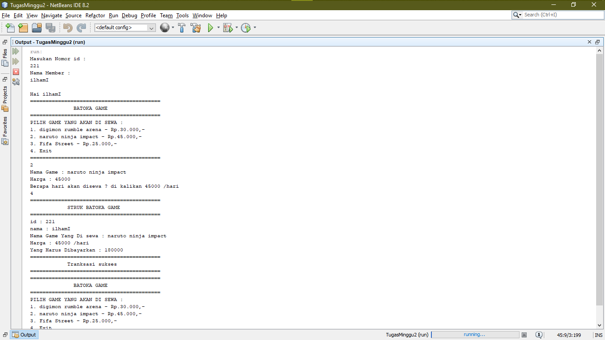
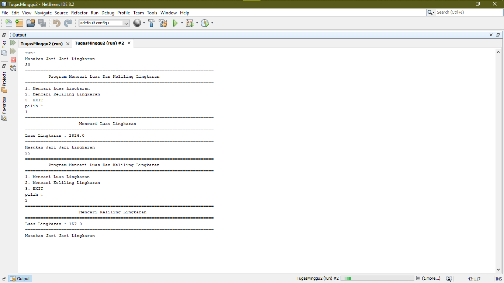

# Laporan Tugas Minggu 1 Mata Kuliah PBO

1. Membuat class diagram (Jawaban No 1)
 

 class diagram ini saya buat melalui draw.io pembuatan class diagram ini dibuat secara online, alur program yang dimaksud dalam diagram tersebut adalah adanya atribut id dalam bentuk integer , nama member dalam bentuk string , nama game dalam bentuk string , dan harga game dalam bentuk integer. Sedangkan untuk method nya sendiri ada id,nama member,cetak status,nama game,harga game,total harga (harga per hari dikalikan berapa lama hari sewa),cetak status game dan harga (sebagai check out menampilkan game dan harga yang disewa satu hari).

2. Game Mart (Jawaban No 2)
 

 program ini adalah akses untuk pembeli jika ingin menyewa dan mengetahui berapa yang harus dibayar jika menyewa lebih dari 1 hari sedangkan sistem dapat menyimpan id dan nama member yang menyewa video game.

3. Program mencari luas dan keliling lingkaran (Jawaban No 3)
 

 program ini mencari luas dan keliling lingkaran dengan inputan jari jari di awal.

4.  udur udur mart (Jawaban No 4)
 

program ini adalah list produk dan harga dari udur udur mart dan setelah memilih produk udur udur mart menanyakan apakah member atau tidak jika member junior maka diberikan diskon 15 % sedangkan member senior diberikan diskon 30 % dan akan muncul harga jual yang sudah di potong oleh diskon.
